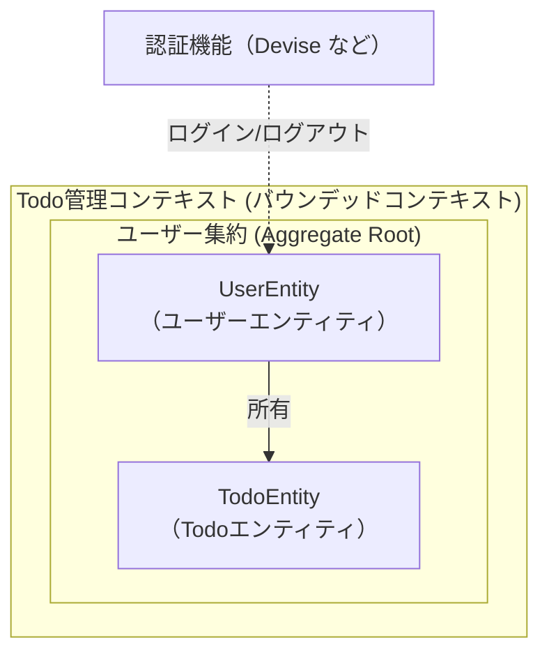

# 📝 Todo App - DDD User Aggregate Architecture

LaravelとDDD（ドメイン駆動設計）で実装した認証付きTodoアプリケーションです。  
**User Aggregate Root**を中心とした本格的なDDDアーキテクチャを採用し、  
ドメインモデルとインフラストラクチャを明確に分離しています。

---

## ✨ 主な特徴

- ✅ **DDD (Domain-Driven Design)**: User Aggregateを中心とした設計  
- ✅ **オニオンアーキテクチャ**: Domain、Application、Infrastructure、Presentationの4層構造  
- ✅ **認証機能**: Laravel Breeze統合  
- ✅ **ValueObject**: ドメインロジックのカプセル化  
- ✅ **Repository Pattern**: データアクセスの抽象化  
- ✅ **モダンUI**: BEM CSS (カスタムデザイン) + Laravel Breeze (認証)  

---

## 📚 目次

1. [機能](#-機能)
2. [ユースケース](#-ユースケース)
3. [主な特徴](#-主な特徴)
4. [アーキテクチャ](#-アーキテクチャ)
5. [セットアップ](#-セットアップ)
6. [アプリケーションの起動](#-アプリケーションの起動)
7. [初回利用](#-初回利用)
8. [テスト](#-テスト)
9. [技術スタック](#-技術スタック)
10. [主要な設計パターン](#-主要な設計パターン)
11. [「2つのモデル」問題の解決](#-2つのモデル問題の解決)
12. [主要なコマンド](#-主要なコマンド)
13. [今後の拡張案](#-今後の拡張案)
14. [参考資料](#-参考資料)
15. [ライセンス](#-ライセンス)

---

## ✨ 機能

- ✅ 認証（ログイン／新規登録／ログアウト）  
- ✅ プロフィール編集  
- ✅ タスクの作成  
- ✅ タスク一覧の表示  
- ✅ タスクの詳細表示  
- ✅ タスクの編集  
- ✅ タスクの削除  
- ✅ タスクの完了／未完了切替  
- ✅ ステータスでの絞り込み（全て／完了／未完了）  

---

## 📖 ユースケース

### 認証管理（Laravel Breeze使用）

| ユースケース名 | 実装 | 概要 |
|----------------|------|------|
| ユーザー登録 | Laravel Breeze | 新規ユーザーアカウントを作成する |
| ログイン | Laravel Breeze | メールアドレスとパスワードで認証する |
| ログアウト | Laravel Breeze | セッションを破棄してログアウトする |
| パスワードリセット | Laravel Breeze | メール経由でパスワードをリセットする |

**注記**: 認証機能はLaravel Breezeの標準機能を使用しており、DDD化していません。

### プロフィール管理

| ユースケース名 | 対応Service | 概要 |
|----------------|--------------|------|
| プロフィール情報を更新する | `UpdateUserProfileService` | ユーザーの名前とメールアドレスを更新する（メール重複チェック含む） |
| パスワードを更新する | `UpdateUserPasswordService` | 現在のパスワードを検証後、新しいパスワードに変更する |
| アカウントを削除する | `DeleteUserAccountService` | ユーザーアカウントを削除する（所有Todoも自動削除） |

### Todo管理

| ユースケース名 | 対応Service | 概要 |
|----------------|--------------|------|
| ユーザーにTodoを追加する | `AddTodoToUserService` | 認証ユーザーを取得し、新しいTodoIDを採番してUserに追加後、保存する |
| ユーザーのTodoを更新する | `UpdateTodoOfUserService` | UserからTodoを検索し、タイトルを更新して保存する |
| Todoステータスを切り替える | `ToggleTodoStatusService` | UserからTodoを検索し、完了／未完了を切り替える |
| ユーザーのTodoを削除する | `DeleteTodoOfUserService` | Userから指定Todoを削除して保存する |
| ユーザーのTodo一覧を取得する | `GetUserTodosService` | Userの全Todoを取得し、フィルター処理を行う |

---

## 🏗 アーキテクチャ

### User Aggregate

このアプリケーションは**User Aggregate**を中心に設計されています。

```
User (Aggregate Root)
├── UserId (ValueObject)
├── UserName (ValueObject)
├── Email (ValueObject)
└── Todos (子エンティティのコレクション)
    └── Todo (子エンティティ)
        ├── TodoId (ValueObject)
        ├── TaskTitle (ValueObject)
        ├── TaskStatus (ValueObject)
        └── DateTimeValue (ValueObject)
```

**重要な原則**:
- TodoはUserに所有される（Userなしでは存在しない）
- TodoへのすべてのCRUD操作はUser経由で行う
- User削除時にTodoも自動削除される（Cascade）



### ディレクトリ構造

```
app/
├── Domain/                            # ドメイン層
│   ├── Shared/                        # 共通部品
│   │   ├── ValueObject/
│   │   │   ├── Id.php                 # ID基底クラス
│   │   │   └── DateTimeValue.php     # 日時値オブジェクト
│   │   ├── Exception/
│   │   │   └── DomainException.php    # ドメイン例外基底
│   │   └── Service/                   # 複数Aggregate間のドメインサービス
│   │       └── README.md              # 配置ガイド（現在は未使用）
│   │
│   └── UserAggregate/                 # User集約
│       ├── Entity/
│       │   ├── UserEntity.php         # Aggregate Root
│       │   └── TodoEntity.php         # 子エンティティ
│       ├── ValueObject/
│       │   ├── UserId.php
│       │   ├── UserName.php
│       │   ├── Email.php
│       │   ├── TodoId.php
│       │   ├── TaskTitle.php
│       │   └── TaskStatus.php
│       ├── Repository/
│       │   └── UserRepositoryInterface.php
│       └── Service/                   # User Aggregate固有のドメインサービス
│           └── README.md              # 配置ガイド（現在は未使用）
│
├── Application/                        # アプリケーション層
│   └── UserAggregate/
│       └── Service/                    # ユースケース実装
│           ├── AddTodoToUserService.php
│           ├── UpdateTodoOfUserService.php
│           ├── ToggleTodoStatusService.php
│           ├── DeleteTodoOfUserService.php
│           ├── GetUserTodosService.php
│           ├── UpdateUserProfileService.php     # プロフィール更新
│           ├── UpdateUserPasswordService.php    # パスワード更新
│           └── DeleteUserAccountService.php     # アカウント削除
│
├── Infrastructure/                     # インフラ層
│   └── UserAggregate/
│       └── Repository/
│           └── UserRepository.php      # Eloquent実装
│
├── Http/                               # プレゼンテーション層
│   ├── Controllers/
│   │   ├── TodoController.php
│   │   └── ProfileController.php
│   └── Requests/
│       ├── StoreTodoRequest.php
│       ├── UpdateTodoRequest.php
│       └── ProfileUpdateRequest.php
│
└── Models/                             # Eloquent ORM
    ├── User.php                        # Eloquent Model (認証用)
    └── Todo.php                        # Eloquent Model
```

### View & CSS 構造

```
resources/
├── views/
│   ├── layouts/
│   │   └── main.blade.php              # カスタムBEMレイアウト
│   │
│   ├── components/
│   │   ├── header.blade.php            # カスタムヘッダーコンポーネント
│   │   └── breeze/                     # Laravel Breeze認証コンポーネント
│   │       ├── app-layout.blade.php
│   │       ├── guest-layout.blade.php
│   │       ├── navigation.blade.php
│   │       └── (その他13個のコンポーネント)
│   │
│   ├── todos/                          # Todoページビュー
│   │   ├── index.blade.php
│   │   ├── create.blade.php
│   │   ├── show.blade.php
│   │   └── edit.blade.php
│   │
│   ├── auth/                           # 認証ページ（Breeze）
│   └── profile/                        # プロフィール
│
└── css/
    ├── app.css                         # エントリーポイント
    ├── common.css                      # 共通スタイル（ヘッダー、ボタン、レイアウト）
    └── todos/                          # ページ固有スタイル
        ├── index.css
        ├── show.css
        └── edit.css
```

**設計原則**:
- `layouts/`: カスタムレイアウト（`main.blade.php`のみ）
- `components/`: 再利用可能なコンポーネント
- `components/breeze/`: Laravel Breeze関連を分離
- `css/common.css`: アプリ全体の共通スタイル
- `css/todos/`: Todosページ固有のスタイル

### レイヤー間の依存関係

```
🧩 Presentation
        ↓
⚙️ Application
        ↓
💡 Domain
        ↑
🗄️ Infrastructure
```

**ルール**:
- Domain層は他の層に依存しない
- Application層はDomain層のみに依存
- Infrastructure層はDomain層のインターフェースを実装
- Presentation層はApplication層を呼び出す

### Domain Service（ドメインサービス）

現在このアプリケーションでは使用されていませんが、将来的に以下のようなケースで必要になる可能性があります：

#### 📁 配置場所と用途

1. **`Domain/{Aggregate}/Service/`** - Aggregate固有のドメインサービス
   - ✅ **特定のAggregateに特化**したビジネスルール
   - ✅ **Repositoryアクセスが必要**なドメインロジック
   - ✅ **複数インスタンス間の操作**（同じAggregate型）
   - 例: メールアドレス重複チェック、Todo移譲（User間）

2. **`Domain/Shared/Service/`** - 汎用的なドメインサービス
   - ✅ **どのAggregateでも使える汎用的な**ドメインロジック
   - ✅ **異なる種類のAggregateをまたがる**処理
   - 例: パスワードハッシュ化、異なるAggregate間の協調（UserとProject）

#### 🆚 Domain Service vs Application Service

| 項目 | Domain Service | Application Service |
|------|----------------|---------------------|
| **レイヤー** | Domain層 | Application層 |
| **責務** | **ドメインロジック**（ビジネスルール） | **ユースケース**の実現（処理の流れ） |
| **依存** | Repository Interface のみ | Domain + Infrastructure |
| **再利用性** | 高い（複数箇所から利用） | 低い（1ユースケースに特化） |

詳細は各Serviceディレクトリ内の `README.md` を参照してください。

## 🚀 セットアップ

### 必要要件

- PHP 8.2以上
- Composer
- SQLite（またはMySQL/PostgreSQL）
- Node.js & npm

### インストール手順

```bash
# 依存パッケージをインストール
composer install
npm install

# 環境設定ファイルをコピー
cp .env.example .env

# アプリケーションキーを生成
php artisan key:generate

# データベースマイグレーション
php artisan migrate

# アセットをビルド
npm run dev
```

## 🎮 アプリケーションの起動

### 開発サーバー起動

```bash
# アセットをビルド（初回またはCSSを変更した場合）
npm run build

# Laravelサーバー起動
php artisan serve
```

**ホットリロード開発の場合**:
```bash
# ターミナル1: Laravelサーバー
php artisan serve

# ターミナル2: Vite（ホットリロード）
npm run dev
```

http://localhost:8000 にアクセス

## 初回利用

### 1. アカウント作成

1. ブラウザで `http://localhost:8000/register` にアクセス  
2. 新規登録ページで以下を入力：  
   - Name: 任意のユーザー名（例: 太郎）  
   - Email: 有効なメールアドレス（例: taro@example.com）  
   - Password: 8文字以上  
   - Confirm Password: 同一のパスワード  
3. Registerボタンをクリック  
4. 登録成功後 `/todos` にリダイレクト  

### 2. ログイン

1. `http://localhost:8000/login` にアクセス  
2. 登録済みメールアドレスとパスワードを入力  
3. Log inボタンをクリック  
4. `/todos` ページへ遷移  

---

## 🧪 テスト

```bash
# 全テスト実行
php artisan test

# カバレッジ付きテスト実行
XDEBUG_MODE=coverage php artisan test --coverage

# 特定のテストを実行
php artisan test tests/Feature/TodoControllerTest.php
```

---

## 🛠 技術スタック

- **Framework**: Laravel 12
- **Authentication**: Laravel Breeze
- **Frontend**: 
  - Blade Template Engine
  - BEM CSS (カスタムUI)
  - Tailwind CSS (認証ページのみ)
  - Vite (Asset Bundler)
- **Database**: SQLite (デフォルト)
- **Testing**: PHPUnit + Pest
- **Architecture**: DDD + Layered Architecture

---

## 🔑 主要な設計パターン

### 1. Aggregate Pattern
User AggregateがTodoを所有し、整合性を保証

### 2. Repository Pattern
データアクセスを抽象化し、Domain層をインフラから分離

### 3. Value Object
不変の値オブジェクトでドメインルールをカプセル化

### 4. Application Service
ユースケースを1つのトランザクション単位で実装

### 5. Dependency Injection
Laravel Service Containerによる疎結合

---

## 🤔 「2つのモデル」問題の解決
このアプリケーションでは、**Eloquent Model** と **Domain Entity** が共存しています。

---

## 📝 主要なコマンド

```bash
# マイグレーション
php artisan migrate
php artisan migrate:fresh  # 全テーブル削除して再作成

# テスト
php artisan test
php artisan test --filter TodoControllerTest

# キャッシュクリア
php artisan cache:clear
php artisan config:clear
php artisan route:clear
php artisan view:clear

# コード生成
php artisan make:migration CreateXxxTable
php artisan make:model XxxModel
php artisan make:controller XxxController
```

## 🎯 今後の拡張案

- [ ] Todo に期限（deadline）追加
- [ ] TodoをProjectで分類
- [ ] Todoへのタグ付け機能
- [ ] TodoのソートとフィルタリングUI
- [ ] API化（Laravel Sanctum）
- [ ] Event Sourcing導入
- [ ] CQRS パターン適用

## 📚 参考資料

- [Domain-Driven Design by Eric Evans](https://www.domainlanguage.com/ddd/)
- [Laravel Documentation](https://laravel.com/docs)
- [Clean Architecture by Robert C. Martin](https://blog.cleancoder.com/uncle-bob/2012/08/13/the-clean-architecture.html)

## 📄 ライセンス

MIT License

---

Made with ❤️ using Laravel & DDD
